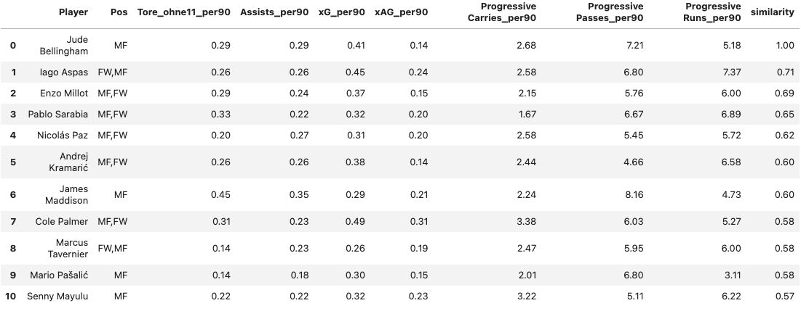

# ⚽ Spielerähnlichkeit in der Fußballanalyse

Dieses Projekt ermöglicht den datenbasierten Vergleich von Fußballspielern anhand statistischer Leistungsprofile pro 90 Minuten. Ziel ist es, mithilfe von Ähnlichkeitsmaßen wie der Kosinus-Ähnlichkeit und gewichteter Merkmalsvergleiche Spieler mit ähnlichen Spielstilen oder Leistungsprofilen zu identifizieren.

## 📥 Datenquelle

Die Daten stammen aus dem öffentlichen Kaggle-Datensatz:

**📎 [All Football Players Stats in Top 5 Leagues 24/25 (Kaggle)](https://www.kaggle.com/datasets/orkunaktas/all-football-players-stats-in-top-5-leagues-2425?resource=download)**  
Autor: [orkunaktas](https://www.kaggle.com/orkunaktas)

Dieser enthält umfassende Leistungsdaten von Spielern aus den Top-5 europäischen Ligen der Saison 2024/25.

## 🔍 Funktionen

- Filterung nach Spielzeit (z. B. mindestens 450 Minuten)
- Auswahl relevanter Leistungsmetriken:
  - Tore ohne Elfmeter pro 90 Minuten
  - Assists pro 90 Minuten
  - Expected Goals (xG) pro 90 Minuten
  - Expected Assists (xAG) pro 90 Minuten
  - Progressive Carries / Passes / Runs pro 90 Minuten
- Standardisierung und gewichtete Bewertung der Attribute basierend auf der individuellen Spielerstärke
- Berechnung der Ähnlichkeit zwischen Spielern
- Ausgabe der Top 10 ähnlichsten Spieler zu einem gegebenen Spieler

> ℹ️ **Hinweis**: Die Qualität und Aussagekraft der Ähnlichkeitsanalyse steigt mit der Anzahl und Tiefe der verfügbaren Spieldaten. Zusätzliche Metriken (z. B. Defensivaktionen, Ballverluste, Positionsdaten) können die Ergebnisse weiter verbessern.

## 📊 Beispielergebnisse
Als Beispiel hier einmal das Ergebnis des Modells für Leroy Sané und Jude Bellingham:
Berücksichtigt werden also nicht nur Tor- und Assistwerte, sondern auch ihr Beitrag zum Spielfluss durch progressive Aktionen.

Leroy Sané:


Jude Bellingham:



## Genutzte Bibliotheken:
- Python 3.x
- Pandas
- NumPy
- Scikit-Learn

## Projektstruktur
```text
football-player-similarity/
├── Datenanalyse.ipynb   # Code zur Analyse von Videos zur Ballkontakt-Erkennung       # Jupyter-Notebook zur vorangegangenen Datenanalyse des Datensatzes
├── find_similar_players.ipynb                                                         # Jupyter-Notebook zum finden von ähnlichen Spielern          
├── Beispiel_Leroy_Sané.png                                                            # Ergebnise des Modells mit Leroy Sané als Zielspieler
└── Beispiel_Jude_Bellingham.png                                                       # Ergebnise des Modells mit Jude Bellingham als Zielspieler

```

